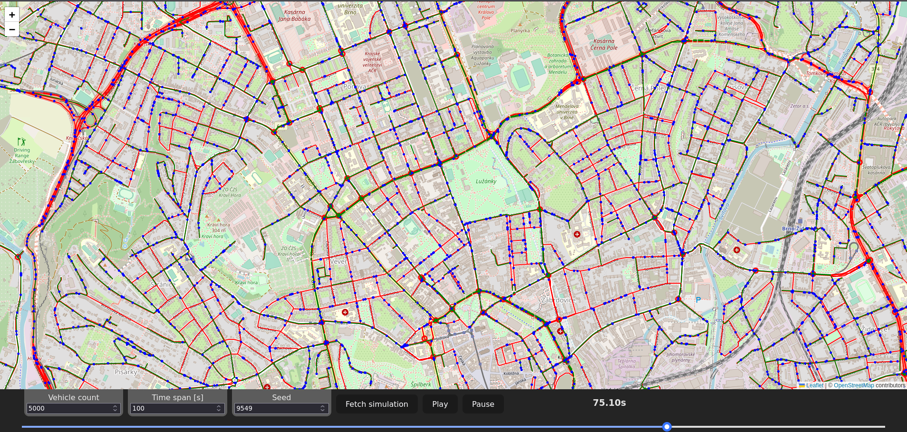

# Návod na spustenie aplikácie

## Predpoklady

- [Node.js](https://nodejs.org/en/) (verzia >=18.15)
- [npm](https://www.npmjs.com/) (verzia >=9.5)
- [Python](https://www.python.org/) (verzia 3.10)

- [pip](https://pypi.org/project/pip/) (verzia >=23.1) alebo [pipenv](https://pypi.org/project/pipenv/) (verzia >=2022.9)

## Server

```
cd server
```

### Inštalácia závislostí:

```
pip install -r requirements.txt
```

alebo

```
pipenv install
```

### Spustenie:

```
python main.py
```

alebo

```
pipenv run python main.py
```

## Klient

```
cd client
```

### Inštalácia závislostí:

```
npm install
```

### Spustenie vo vývojovom móde:

```
npm run dev
```

### Vygenerovanie produkčného buildu:

```
npm run build
```

# Ukážka užívateľského rozhrania


